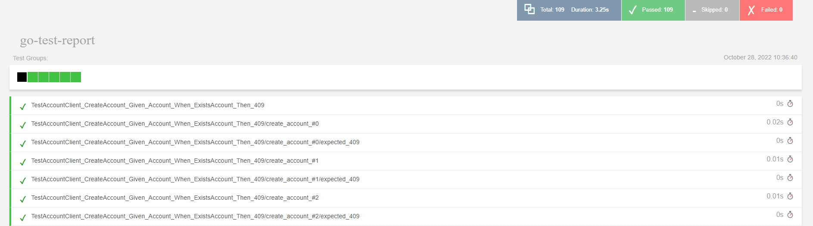

# Junyoung Choi

## I am New to GO :smile:
The project started on October 18, 2022.

I started Go for the first time. It was interesting because it was a little different from other languages that I used before. 

For more details, I have used the latest version of Golang (1.19) and tried to make it general for other projects. The sources in the pkg/client are general library, and the Form3 client in the examples is the result of using them. When I made this project, as I am starting Go for the first time, I decided to try generic programming supported from 1.18. I tried to make the request and response data generic. In addition, I included my app in `docker-compose.yml` and passed the tests I implemented by docker-compose up.

# Summary

<details><summary>Directory Structure</summary>

<p>

> I organized it as follows.

```
|-- examples
|   `-- form3
|       |-- client
|       |   `-- accounts
|       |       |-- features
|       |       |   |-- createAccount
|       |       |   |-- deleteAccount
|       |       |   |-- getAccount
|       |       |   `-- retry
|       |       |-- test
|       |       `-- types
|       |-- commons
|       `-- models
|           `-- account
|-- pkg
|   `-- client
|-- scripts
|   `-- db
- - models/accounts
```

</p>
</details>
&nbsp;


<details><summary>Example Use</summary>

<p>

`DELETE` and `GET` account can also be used in the same way.

- If you don't need an option, you can use it.
```go
got, err := client.CreateAccount(&account)
if err != nil {
    ...
}
fmt.Println(got.ContextData.Data.Id)
```

- This can be used if a retry is required. Additionally, you can set a retry when you create the Client.
```go
got, err = client.NewCreateAccountRequest(&reqData).
            WithRetry(client.Retry{
            RetryInterval: r.retryWaitMs,
            RetryMax:      r.retryAttempts,
            }).Do()
```

- This is used when using context.
```go
got, err = client.CreateAccountWithContext(ctx, &account)
```

- This is used when you want to manipulate data.
```go
got, err = client.NewCreateAccountRequest(&account).
    	    WhenBeforeDo(func(rc *types.CreateAccountRequestContext) error {
            ... // validate
			return nil
		    }).WhenAfterDo(func(rc *types.CreateAccountResponseContext) error {
            ...
		    return nil
	        }).Do()
```

- This is used when you want to get accounts filtered.
```go
got, err = client.GetAllAccount(
            types.WithPage(0, 1),
            types.WithFilter("country", "GB"))
```

</p>
</details>

&nbsp;

## Tests
The client used fake account API, which is provided as a Docker container in the file `docker-compose.yaml` for operations HTTP Methods `CREATE`, `DELETE`, and `GET`, and Mockserver used it for context, timeout, and retry.
### Used Packages
- testing package for TDD
- [godog](https://github.com/cucumber/godog) for BDD
- [lo](https://github.com/samber/lo) 


<details><summary>Scenario Example</summary>
<p>


### BDD Example
```

    Scenario: after failing twice, it succeeds at the end
        Given MockServer has 150 ms of latency and 50 ms at the end
        And   MockServer returns the 201 response code
        Given RetryAttempt 3 with RetryWait 300 ms per each request
        When I call the method NewCreateAccountRequest with params
            """
            {
                "data": {
                    "id": "e9af97ac-66bc-42da-8e10-5245d8b216df",
                    "organisation_id": "ba61483c-d5c5-4f50-ae81-6b8c039bea43",
                    "type": "accounts",
                    "version": 0,
                    "attributes": {
                        "name": [],
                        "bank_id": "400300",
                        "bank_id_code": "GBDSC",
                        "bic": "NWBKGB22",
                        "country": "GB",
                        "account_matching_opt_out": true
                    }
                }
            }
            """
        And the request is attempted as many times as a given request as
            """
            first response should should be 500
            second request should should be 500
            last request should get the status code 201 and valid data
            """
        Then the response code should be 201
        Then the request was retried 3 times
        Then the response should match json:
            """
            {
                "data": {
                    "id": "e9af97ac-66bc-42da-8e10-5245d8b216df",
                    "organisation_id": "ba61483c-d5c5-4f50-ae81-6b8c039bea43",
                    "type": "accounts",
                    "version": 0,
                    "attributes": {
                        "name": [],
                        "bank_id": "400300",
                        "bank_id_code": "GBDSC",
                        "bic": "NWBKGB22",
                        "country": "GB",
                        "account_matching_opt_out": true
                    }
                }
            }
            """

```

</p>
</details>

### Result

<br>


## What I expect in microservices environments

In terms of microservices environments, data may or may not be sent or received for unexpected reasons. It should require implement a retry function on the client side to increase the transmission probability. In addition, in order to reduce unnecessary traffic, it is necessary to check in advance whether data is valid on the client side. Additionally, in a microservices environment, distributed message queues should be used to guarantee the requested data; it can use things like Kafka, Nats and Redis. Also, it can be used common event delivery methods like CloudEvents with Knative and Kafka or Nats jetstream to communicate between services and use pub/sub. Additionally, container cold start and warm start in Cloud with Kubernetes environment will also have an impact in microservices environment.


[Choosing Cloud Native Technologies for the Journey to Multi-cloud - Adelina Simion, Form3](https://www.youtube.com/watch?v=NGuiizWUuaw)

# Form3 Take Home Exercise

### Shoulds

The finished solution **should:**
- Be written in Go.
- Use the `docker-compose.yaml` of this repository.
- Be a client library suitable for use in another software project.
- Implement the `Create`, `Fetch`, and `Delete` operations on the `accounts` resource.
- Be well tested to the level you would expect in a commercial environment. Note that tests are expected to run against the provided fake account API.
- Be simple and concise.
- Have tests that run from `docker-compose up` - our reviewers will run `docker-compose up` to assess if your tests pass.

## How to submit your exercise

- Include your name in the README. If you are new to Go, please also mention this in the README so that we can consider this when reviewing your exercise
- Create a private [GitHub](https://help.github.com/en/articles/create-a-repo) repository, by copying all files you deem necessary for your submission
- [Invite](https://help.github.com/en/articles/inviting-collaborators-to-a-personal-repository) [@form3tech-interviewer-1](https://github.com/form3tech-interviewer-1) to your private repo
- Let us know you've completed the exercise using the link provided at the bottom of the email from our recruitment team

## License

Copyright 2019-2022 Form3 Financial Cloud

Licensed under the Apache License, Version 2.0 (the "License"); you may not use this file except in compliance with the License.
You may obtain a copy of the License at

http://www.apache.org/licenses/LICENSE-2.0

Unless required by applicable law or agreed to in writing, software distributed under the License is distributed on an "AS IS" BASIS, WITHOUT WARRANTIES OR CONDITIONS OF ANY KIND, either express or implied. See the License for the specific language governing permissions and limitations under the License.